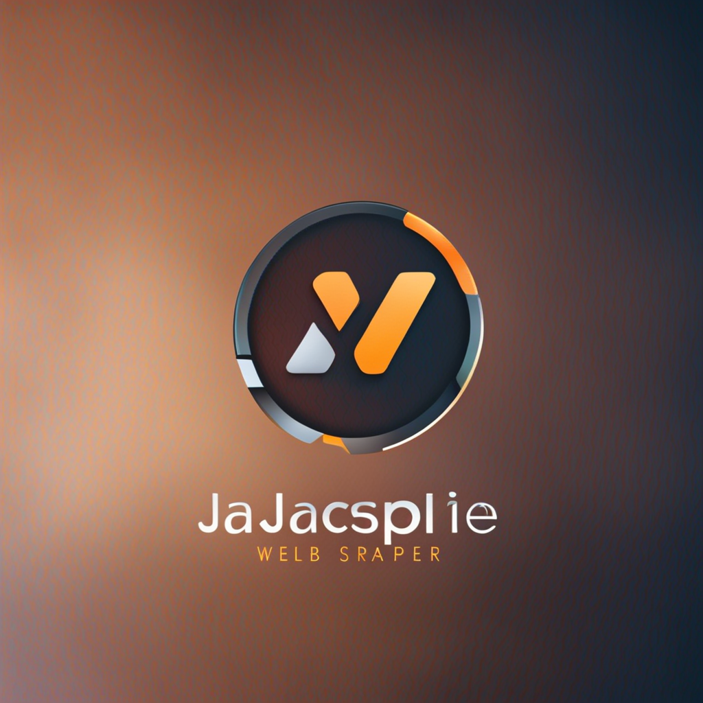

<!-- Improved compatibility of back to top link: See: https://github.com/othneildrew/Best-README-Template/pull/73 -->
<a name="readme-top"></a>


<!-- PROJECT SHIELDS -->
<!--
*** I'm using markdown "reference style" links for readability.
*** Reference links are enclosed in brackets [ ] instead of parentheses ( ).
*** See the bottom of this document for the declaration of the reference variables
*** for contributors-url, forks-url, etc. This is an optional, concise syntax you may use.
*** https://www.markdownguide.org/basic-syntax/#reference-style-links
-->


<!-- PROJECT LOGO -->
<br />
<div align="center">
  <a href="https://github.com/s33chin/web-scraper">
    
  </a>

  <h3 align="center">Web Scraper</h3>

  <p align="center">
    Node.js and puppeteer web scraper with auto scrolling!
  </p>
</div>


<!-- TABLE OF CONTENTS -->
<details>
  <summary>Table of Contents</summary>
  <ol>
    <li>
      <a href="#about-the-project">About The Project</a>
      <ul>
        <li><a href="#built-with">Built With</a></li>
      </ul>
    </li>
    <li>
      <a href="#getting-started">Getting Started</a>
      <ul>
        <li><a href="#prerequisites">Prerequisites</a></li>
        <li><a href="#installation">Installation</a></li>
      </ul>
    </li>
    <li><a href="#usage">Usage</a></li>
    <li><a href="#roadmap">Roadmap</a></li>
    <li><a href="#acknowledgments">Acknowledgments</a></li>
  </ol>
</details>


<!-- ABOUT THE PROJECT -->
## About The Project

<div align="center">

</div>


Purpose: This web scraper is designed to extract data from websites automatically, enabling users to gather valuable information quickly and efficiently. It is a form of copying, in which specific data is gathered and copied from the web, typically into a central local database or spreadsheet, for later retrieval or analysis.

Features:
* Login and Authentication: The scraper can handle login and authentication processes, allowing access to protected areas of websites.
* Infinite Scroll Support: It can navigate through pages with infinite scroll, capturing dynamic content as it loads.
* Data Extraction: The scraper can extract specific data elements such as names, emails, phone numbers, and addresses from targeted web pages.
* Page Pooling: To optimize performance, it utilizes a page pooling mechanism, reusing and managing browser pages effectively.


<p align="right">(<a href="#readme-top">back to top</a>)</p>


### Built With


<p align="left"><a href="https://nodejs.org/en/" target="_blank" rel="noreferrer"></a></p><p align="left"><a href="https://pptr.dev/" target="_blank" rel="noreferrer"> </a></p><p align="left"><a href="https://www.ecma-international.org/" target="_blank" rel="noreferrer"></a></p>

<p align="right">(<a href="#readme-top">back to top</a>)</p>


<!-- GETTING STARTED -->
## Getting Started

This web scraping project allows you to extract data from websites (10ksb) efficiently. Follow the steps below to get started

### Prerequisites

Node.js and npm: Ensure you have Node.js (v20 or above) and npm (Node Package Manager) installed on your machine. You can check this by running the following commands in your terminal:

* node
  ```sh
  node -v
  ```
* npm
  ```sh
  npm install npm@latest -g
  ```

Chrome Browser: The project utilizes Puppeteer(v14.20), which requires Google Chrome (v103) or Chromium to be installed on your system.

### Installation


1. Clone the repo
   ```sh
   git clone https://github.com/s33chin/web-scraper.git
   ```
2. Install NPM packages
   ```sh
   npm install puppeteer@14.2.0 @puppeteer/browsers cli-progress puppeteer-core   
   ```
3. Adjust the Chrome executable path and other settings in the scrapeData     function to match your system.

4. Run the script
   ```sh
   node indexWithPooling.js
   ```  

Note: Ensure that you have proper permissions and authorization to scrape data from the target website. Respect the website's terms of service and policies while scraping.

<p align="right">(<a href="#readme-top">back to top</a>)</p>


<!-- USAGE EXAMPLES -->
## Usage
<p align="center">
  
</p>


<p align="right">(<a href="#readme-top">back to top</a>)</p>


<!-- ROADMAP -->
## Roadmap

- [ ] Auto re-login and authentication after session timeout
- [ ] Proxy and User-Agent Rotation
- [ ] Data Storage Options: CSV, JSON, Database
- [ ] User-Friendly CLI Interface
- [ ] Support for Multiple Browsers


<p align="right">(<a href="#readme-top">back to top</a>)</p>


<!-- ACKNOWLEDGMENTS -->
## Acknowledgments


* [freeCodecamp](https://www.freecodecamp.org/news/web-scraping-in-javascript-with-puppeteer/)
* [Puppeteer](https://pptr.dev/)
* [puppeteer git](https://github.com/puppeteer/puppeteer)
* [Developer Chrome](https://developer.chrome.com/docs/puppeteer/)


<p align="right">(<a href="#readme-top">back to top</a>)</p>


<!-- MARKDOWN LINKS & IMAGES -->
<!-- https://www.markdownguide.org/basic-syntax/#reference-style-links -->
[contributors-shield]: https://img.shields.io/github/contributors/othneildrew/Best-README-Template.svg?style=for-the-badge
[contributors-url]: https://github.com/othneildrew/Best-README-Template/graphs/contributors
[forks-shield]: https://img.shields.io/github/forks/othneildrew/Best-README-Template.svg?style=for-the-badge
[forks-url]: https://github.com/othneildrew/Best-README-Template/network/members
[stars-shield]: https://img.shields.io/github/stars/othneildrew/Best-README-Template.svg?style=for-the-badge
[stars-url]: https://github.com/othneildrew/Best-README-Template/stargazers
[issues-shield]: https://img.shields.io/github/issues/othneildrew/Best-README-Template.svg?style=for-the-badge
[issues-url]: https://github.com/othneildrew/Best-README-Template/issues
[license-shield]: https://img.shields.io/github/license/othneildrew/Best-README-Template.svg?style=for-the-badge
[license-url]: https://github.com/othneildrew/Best-README-Template/blob/master/LICENSE.txt
[linkedin-shield]: https://img.shields.io/badge/-LinkedIn-black.svg?style=for-the-badge&logo=linkedin&colorB=555
[linkedin-url]: https://linkedin.com/in/othneildrew
[product-screenshot]: 
